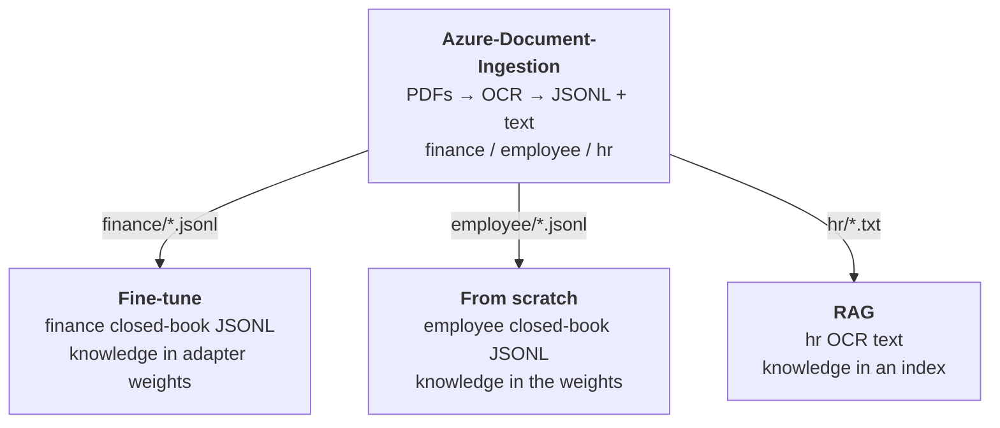

# Document Ingestion on Azure

Generates three small business-document datasets, OCRs them with Azure AI Document Intelligence, and produces the training data for the fine-tuned model.

```
PDF  ->  Blob Storage (raw)  ->  Document Intelligence  ->  Blob Storage (curated)  ->  JSONL
```

---

## The three datasets

Generates three small business-document datasets, OCRs them with Azure AI Document
Intelligence, and produces the training data the other repos consume.

| Dataset | Documents | Handle | Example question | What is used for? |
|---|---|---|---|---|
| **employee** | 5 timesheets + 5 expense reports | employee name | *How many hours did Maya Patel work?* | Trains a 3.2M-parameter model from scratch, random weights up |
| **finance** | 5 invoices + 5 purchase orders | vendor | *What is the Zephyr Networks invoice total?* | Fine-tunes Qwen2.5-3B with QLoRA, serves it, wraps it in an agent |
| **hr** | 5 policies + 5 leave requests | policy title / employee | *Who approves requests under the Overtime Policy?* | Retrieval over an index, no training at all |

## How they depend on each other



## Prerequisites

### Permissions

You need to be **Owner** on the subscription, or Owner plus User Access Administrator. Both
Terraform stacks create role assignments, and several steps grant roles to managed identities.

### GPU quota

This blocks more people than anything else.Need an Azure **Machine Learning**
quota for the `Standard NCASv3_T4 Family`, which is **separate from the Virtual Machines quota
of the same family**. A fresh subscription usually has 0.

Portal → **Quotas → Machine Learning → your region → Standard NCASv3_T4 Family**. If the limit
is 0, request **12 cores** before you start. Approval took under an hour for us, but it can take
longer, and you cannot proceed without it.

### Tools

| Tool | Version |
|---|---|
| Azure CLI | 2.89+, plus the ML extension: `az extension add -n ml` |
| Terraform | >= 1.9 |
| Python | 3.11+ |

### Region

Pick one region for everything. It needs three things available together: Document Intelligence,
GPU quota for the T4 family, and your chat model. `eastus`, `westus2` and `westeurope` are safe
choices. Mixing regions across the two Terraform stacks works but adds egress and latency for no
benefit.

---

## Step 1 — deploy the storage and OCR service

Terraform creates them:

```bash
az login
cd terraform
terraform init
terraform apply
cd ..
```

| Resource | Name | Used for |
|---|---|---|
| Resource group | `<prefix>-ingest-rg` | everything below |
| Storage account | `<prefix>ingest<suffix>` | AAD-only, no shared keys |
| Container `raw` | | the uploaded PDFs |
| Container `curated` | | OCR output: `documents/<doc_id>.txt` + `.json` |
| Document Intelligence | `<prefix>-docintel-<suffix>` | the OCR service, `prebuilt-read` model |
| Two role assignments | on the identity running `terraform apply` | `Storage Blob Data Contributor`, `Cognitive Services User` |

Authentication is Azure AD end to end — the storage account has shared keys **disabled** and
Document Intelligence has local auth **disabled**. `az login` is the whole setup; the scripts
use `DefaultAzureCredential`.

Export the connection values (or let `run_all.sh` read them from Terraform):

```bash
export AZURE_STORAGE_ACCOUNT=$(terraform -chdir=terraform output -raw storage_account)
export AZURE_DOCINTEL_ENDPOINT=$(terraform -chdir=terraform output -raw docintel_endpoint)
```

Keep `storage_account` to hand — every other repo needs it.

## Step 2 — run the ingestion

```bash
python3 -m venv .venv
chmod +x .venv/bin/activate
source .venv/bin/activate
pip install -r requirements.txt
chmod +x run_all.sh
bash run_all.sh
```

| # | Command | What it does |
|---|---|---|
| 1 | `generate_pdfs.py --all` | Writes 30 real PDFs with ReportLab, and `ground_truth_<dataset>.json` recording every value it printed — including the structured **facts** |
| 2 | `document_pipeline.py upload` | Copies each dataset into the `raw` container under its own prefix |
| 3 | `document_pipeline.py extract` | OCRs every file with Document Intelligence `prebuilt-read`, writes text + metadata to `curated`. Idempotent — skips what is already done |
| 4 | `build_dataset.py --all` | Open-book JSONL per dataset: OCR text + label |
| 5 | `build_closed_book.py --dataset finance --upload` | **Closed-book JSONL for finance** question → answer, no document text. `--upload` also writes it to `curated/datasets/` so Azure ML reads it from Blob |
| 6 | `build_closed_book.py --dataset employee --upload` | **Closed-book JSONL for employee**, the same way |

### What `--upload` does, and why it matters

`run_all.sh` builds **both** closed-book datasets - finance and
employee and uploads both. You do not have to run anything
extra.

`--upload` is the part that matters: it writes the JSONL into
`curated/datasets/` in Blob Storage, which is where Azure ML reads it from.
Build without `--upload` and the files exist only on your laptop, where the
training job cannot see them.

To rebuild one dataset on its own: (**Optional**)

```bash
python build_closed_book.py --dataset finance  --upload
python build_closed_book.py --dataset employee --upload
```

## Step 3 — what comes out

```
data/pdfs/<dataset>/                 the PDFs
data/pdfs/ground_truth_<dataset>.json    task, instruction, output, facts per document
data/dataset_<dataset>/*.jsonl       open book  - {task, instruction, input: <OCR text>, output}
data/closed_book_<dataset>/*.jsonl   closed book - {task, instruction, input: "", output}
curated/datasets/closed_book_<dataset>/*.jsonl    the same files in Blob Storage - this is what training reads
```

### Check it worked

```bash
az storage blob list --account-name $AZURE_STORAGE_ACCOUNT --container-name curated \
  --auth-mode login --prefix documents/ -o table | head
```

You should see `documents/doc-finance-001.txt`, `doc-employee-001.txt`, `doc-hr-001.txt` and so
on — 30 text files plus their JSON metadata.

### The closed-book data — what trains the weights

```
train        615 rows     50 facts x 12.3 phrasings, plus refusals
validation    61 rows
test         123 rows     a wrapper never seen in training
```

Built straight from the generator's `facts`, not from OCR — so a transcription slip cannot teach
the model a wrong number. Every fact is asked several ways, because a model learns *wording*,
not intent.

### The open-book data

`input` is the genuine Document Intelligence output. It does not produce tidy key-value text —
tables come back as header lines followed by value lines, so a label can sit several lines from
its value:

```
Invoice No.
Issue Date
Due Date
INV-28251
2026-07-28
2026-04-27
```

**No chunking.** The longest document is a few hundred tokens against a 1,024-token context, so
every document goes into the prompt whole.

## Files

```
generate_pdfs.py        three datasets of PDFs + ground truth with structured facts
document_pipeline.py    upload to Blob, OCR with Document Intelligence
build_dataset.py        open-book JSONL per dataset
build_closed_book.py    closed-book Q&A for one dataset (finance, employee or hr)
run_all.sh              all of it, in order - both closed-book datasets included
terraform/              resource group, storage account, containers, Document Intelligence, roles
requirements.txt        azure-identity, azure-storage-blob, azure-ai-documentintelligence, reportlab
data/                   generated, gitignored - regenerates identically from the seed
```

Known limits: PII screening in `extract` is regex and over-flags (it tags, it does not block).
The corpus is synthetic — reproducible and leakage-free, but not real business data. Ten
documents per dataset is enough to demonstrate closed-book recall, not to claim a
generalisation score.
