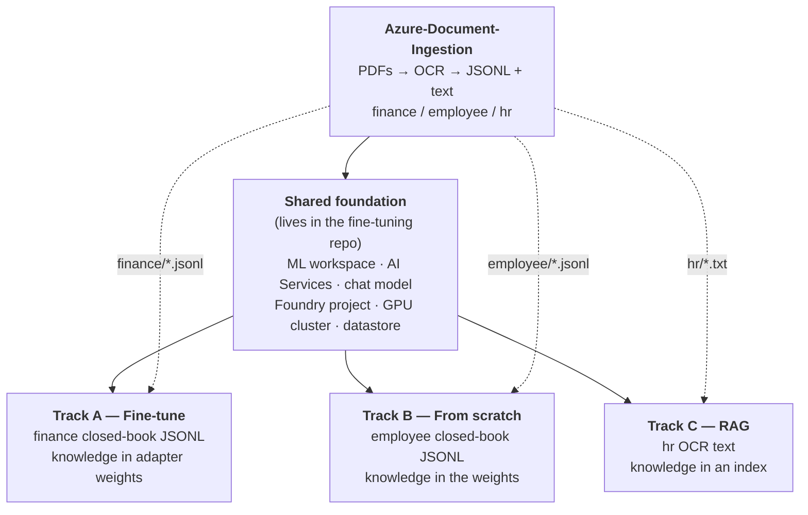

# Document Ingestion on Azure — and the start of the whole build

This repository does two jobs. It is **step one of a four-repo build** that answers the same
business question three different ways, and it is the document ingestion pipeline itself.

**Part 1** is the map of the whole build — read it if you have not run any of this before.
**Part 2** is this repo in detail. **Part 3** is what comes after it.

```
PDF  ->  Blob Storage (raw)  ->  Document Intelligence  ->  Blob Storage (curated)  ->  JSONL
```

---

# Part 1 — The whole build

Four repositories that build the same thing three different ways: a model that can answer
questions about a small set of business documents. The point of the set is the **comparison** —
the three methods fail differently, cost differently, and are secured differently.

Everything is synthetic and reproducible. You can run one track or all three.

| Repository | What it does | Required? |
|---|---|---|
| **Azure-Document-Ingestion** (this repo) | Generates 30 PDFs, OCRs them, produces the training data | **Yes — always first** |
| [Azure-FineTuning-Foundry-Agent](https://github.com/Auxin-io/Azure-FineTuning-Foundry-Agent) | Fine-tunes Qwen2.5-3B with QLoRA, serves it, wraps it in an agent | **Yes — it also builds the shared foundation** |
| [Azure-Employee-Pretraining](https://github.com/Auxin-io/Azure-Employee-Pretraining) | Trains a 3.2M-parameter model from scratch, random weights up | Optional track |
| [Azure-HR-RAG](https://github.com/Auxin-io/Azure-HR-RAG) | Retrieval over an index, no training at all | Optional track |

## How they depend on each other



Two things about this are easy to miss and will cost you an afternoon if you do:

1. **Ingestion is not optional for any track.** It is the only thing that produces the data.
   No OCR output, nothing to train on or index.
2. **The fine-tuning repo is also the shared foundation.** Its Terraform creates the resource
   group, the ML workspace, the AI Services account, the chat-model deployment and the GPU
   cluster that the other two tracks assume already exist. Even if you only want RAG, you run
   its Step 1 and its Foundry-project step.

## Pick your path

| I want to… | Run | GPU quota needed? | Rough time |
|---|---|---|---|
| See the whole comparison | This repo → Foundation → A, B, C | Yes | a day, mostly waiting |
| Fine-tune a real model | This repo → Foundation → **A** | Yes | ~4 h (3 h is training) |
| Train a model from scratch | This repo → Foundation → **B** | Yes | ~1 h (77 s is training) |
| Do RAG only, cheapest path | This repo → Foundation → **C** | **No** — set `enable_gpu_cluster = false` | ~45 min |
| Just see the OCR pipeline | This repo only | No | ~20 min |

The RAG-only path is the one to start with if you are evaluating this. It needs no GPU quota,
trains nothing, and still produces a working agent with citations.

## Prerequisites

### Permissions

You need to be **Owner** on the subscription, or Owner plus User Access Administrator. Both
Terraform stacks create role assignments, and several steps grant roles to managed identities.
Contributor is not enough and fails late, after resources exist.

### GPU quota — check this first

This blocks more people than anything else. Tracks A and B need an Azure **Machine Learning**
quota for the `Standard NCASv3_T4 Family`, which is **separate from the Virtual Machines quota
of the same family**. A fresh subscription usually has 0.

Portal → **Quotas → Machine Learning → your region → Standard NCASv3_T4 Family**. If the limit
is 0, request **12 cores** before you start. Approval took under an hour for us, but it can take
longer, and you cannot proceed without it.

If the request is still pending, set `enable_gpu_cluster = false` in the fine-tuning Terraform
and run the RAG track in the meantime.

### Tools

| Tool | Version |
|---|---|
| Azure CLI | 2.89+, plus the ML extension: `az extension add -n ml` |
| Terraform | >= 1.9 |
| Python | 3.11+ |

### Region

Pick one region for everything. It needs three things available together: Document Intelligence,
GPU quota for the T4 family, and your chat model. `eastus`, `westus2` and `westeurope` are safe
choices. Mixing regions across the two Terraform stacks works but adds egress and latency for no
benefit.

### If you are on Windows

Run everything from **Git Bash**, not PowerShell or CMD, and:

- Prefix any command containing an ARM resource ID with `MSYS_NO_PATHCONV=1`. Without it Git
  Bash rewrites `/subscriptions/...` into a Windows path and the command fails with a confusing
  error about the scope not being found.
- Put `PYTHONIOENCODING=utf-8` in front of the Python scripts, or the agent output crashes on
  the citation characters.

### Choose your own resource names

Both Terraform stacks derive **every** resource name from a single variable, `name_prefix`. Set
it once per stack and all names follow:

```bash
# terraform.tfvars, in each repo's terraform/ directory
name_prefix = "yourprefix"
location    = "eastus"
```

Globally-unique names get a random suffix appended automatically, so two people can run this in
the same subscription without colliding.

**One caveat you have to handle manually.** The three `create_agent.py` scripts hardcode the
resource group, the Foundry project name and the agent name near the top of the file — they do
not read `name_prefix`. If you change the prefix, edit these constants before running them:

| File | Line | Constants to change |
|---|---|---|
| `Azure-FineTuning-Foundry-Agent/agent/create_agent.py` | ~30 | `RG`, `ENDPOINT`, `PROJECT`, `AGENT_NAME` |
| `Azure-Employee-Pretraining/foundry/create_agent.py` | ~30 | `RG`, `ENDPOINT`, `PROJECT`, `AGENT_NAME` |
| `Azure-HR-RAG/rag/create_agent.py` | ~29 | `RG`, `PROJECT`, `AGENT_NAME`, `STORE_NAME` |

`Azure-HR-RAG/rag/fetch_documents.py` is the exception — it reads `AZURE_STORAGE_ACCOUNT` from
the environment, so export that instead of editing it.

Throughout, `<angle-bracket>` values are things you choose or read back from `terraform output`.

---

# Part 2 — This repo

Generates three small business-document datasets, OCRs them with Azure AI Document
Intelligence, and produces the training data the other repos consume.

## The three datasets

Ten documents each. Every document has a **unique natural handle** — the vendor, the employee,
the policy title — so a plain question identifies exactly one document with no id needed.

| Dataset | Documents | Handle | Example question | Feeds |
|---|---|---|---|---|
| **finance** | 5 invoices + 5 purchase orders | vendor | *What is the Zephyr Networks invoice total?* | Track A |
| **employee** | 5 timesheets + 5 expense reports | employee name | *How many hours did Maya Patel work?* | Track B |
| **hr** | 5 policies + 5 leave requests | policy title / employee | *Who approves requests under the Overtime Policy?* | Track C |

The **closed-book** builder produces question → answer pairs with no document text, so a model
trained on them answers from memory. Tracks A and B each need their own closed-book dataset.
Track C needs no closed-book data at all — it reads the OCR text directly.

There is **no access-control step** in this repo. It produces text and labels; permissions, if
needed, belong to whatever serves the model.

## Step 1 — deploy the storage and OCR service

**Nothing here works until the Azure resources exist.** Terraform creates them:

```bash
az login
cd terraform
terraform init
terraform apply          # with your own name_prefix in terraform.tfvars
```

| Resource | Name | Used for |
|---|---|---|
| Resource group | `<prefix>-ingest-rg` | everything below |
| Storage account | `<prefix>ingest<suffix>` | AAD-only, no shared keys |
| Container `raw` | | the uploaded PDFs |
| Container `curated` | | OCR output: `documents/<doc_id>.txt` + `.json` |
| Document Intelligence | `<prefix>-docintel-<suffix>` | the OCR service, `prebuilt-read` model |
| Two role assignments | on the identity running `terraform apply` | `Storage Blob Data Contributor`, `Cognitive Services User` |

Authentication is Azure AD end to end — the storage account has shared keys **disabled** and
Document Intelligence has local auth **disabled**. `az login` is the whole setup; the scripts
use `DefaultAzureCredential`. Granting the two roles needs Owner or User Access Administrator
on the subscription.

**Cost.** The Terraform defaults to **`S0`**, pay-as-you-go at roughly USD 1.50 per 1,000 pages
— about 4 cents for all 30 documents. Set `docintel_sku = "F0"` for the free tier instead: 500
pages a month, but **only one F0 Document Intelligence account is allowed per subscription**,
and the name stays reserved for days after you delete one. Storage for 30 PDFs is a fraction of
a cent. Nothing here bills by the hour.

Export the connection values (or let `run_all.sh` read them from Terraform):

```bash
export AZURE_STORAGE_ACCOUNT=$(terraform -chdir=terraform output -raw storage_account)
export AZURE_DOCINTEL_ENDPOINT=$(terraform -chdir=terraform output -raw docintel_endpoint)
```

Keep `storage_account` to hand — every other repo needs it.

## Step 2 — run the ingestion

```bash
pip install -r requirements.txt
bash run_all.sh
```

| # | Command | What it does |
|---|---|---|
| 1 | `generate_pdfs.py --all` | Writes 30 real PDFs with ReportLab, and `ground_truth_<dataset>.json` recording every value it printed — including the structured **facts** |
| 2 | `document_pipeline.py upload` | Copies each dataset into the `raw` container under its own prefix |
| 3 | `document_pipeline.py extract` | OCRs every file with Document Intelligence `prebuilt-read`, writes text + metadata to `curated`. Idempotent — skips what is already done |
| 4 | `build_dataset.py --all` | Open-book JSONL per dataset: OCR text + label |
| 5 | `build_closed_book.py --dataset finance --upload` | **Closed-book JSONL for finance**: question → answer, no document text. `--upload` also writes it to `curated/datasets/` so Azure ML reads it from Blob |

Every script answers `--help` without an Azure login or the SDK installed.

Tune with environment variables: `COUNT=10 WORKERS=8 DATASETS="finance hr"`.

### If you are running Track B, build the employee set too

`run_all.sh` builds the **finance** closed-book data only. Track B's data assets point at
`closed_book_employee/`, which is never created unless you ask for it:

```bash
python build_closed_book.py --dataset employee --upload
```

`--upload` is the part that matters: it writes the JSONL into `curated/datasets/` in Blob
Storage, which is where Azure ML reads it from. Without `--upload` the files exist only on your
laptop and the training job cannot see them.

Track C needs no extra command — it uses the OCR text `run_all.sh` already produced.

### Check it worked

```bash
az storage blob list --account-name $AZURE_STORAGE_ACCOUNT --container-name curated \
  --auth-mode login --prefix documents/ -o table | head
```

You should see `documents/doc-finance-001.txt`, `doc-employee-001.txt`, `doc-hr-001.txt` and so
on — 30 text files plus their JSON metadata.

## Step 3 — what comes out

```
data/pdfs/<dataset>/                 the PDFs
data/pdfs/ground_truth_<dataset>.json    task, instruction, output, facts per document
data/dataset_<dataset>/*.jsonl       open book  - {task, instruction, input: <OCR text>, output}
data/closed_book_<dataset>/*.jsonl   closed book - {task, instruction, input: "", output}
curated/datasets/closed_book_<dataset>/*.jsonl    the same files in Blob Storage - this is what training reads
```

### The closed-book data — what trains the weights

```
train        615 rows     50 facts x 12.3 phrasings, plus refusals
validation    61 rows
test         123 rows     a wrapper never seen in training
```

Built straight from the generator's `facts`, not from OCR — so a transcription slip cannot teach
the model a wrong number. Every fact is asked several ways, because a model learns *wording*,
not intent:

```
Q  What is the Yarrow Agriculture invoice total?
Q  how much do we owe yarrow agriculture?
Q  Quick question - when is the Yarrow Agriculture invoice due?
A  The Yarrow Agriculture invoice INV-20498 totals $31,926.22.
```

**The split is by phrasing, not by document.** A model cannot recall a document it never saw, so
holding documents out would only measure hallucination. Every document is trained; the test set
asks with a wrapper the model never saw. That is how you learn whether the fact landed durably.

**Refusal rows** teach *"That is not in the 10 finance documents I was trained on"* for vendors
outside the set. Without them a closed-book model invents a confident total for any name you
type.

### The open-book data

`input` is the genuine Document Intelligence output. It does not produce tidy key-value text —
tables come back as header lines followed by value lines, so a label can sit several lines from
its value:

```
Invoice No.
Issue Date
Due Date
INV-28251
2026-07-28
2026-04-27
```

**No chunking.** The longest document is a few hundred tokens against a 1,024-token context, so
every document goes into the prompt whole.

## Hand off to training

The other repos register the Blob files directly as Azure ML data assets; nothing is copied
between repositories:

```
https://<storage-account>.blob.core.windows.net/curated/datasets/closed_book_finance/train.jsonl
https://<storage-account>.blob.core.windows.net/curated/datasets/closed_book_finance/validation.jsonl
```

The training compute needs **Storage Blob Data Reader** on this storage account (shared keys are
disabled; access is by identity only). Part 3 shows how to grant it.

The JSONL format is four string fields, the same for both modes:

```json
{"task": "recall", "instruction": "What is the Zephyr Networks invoice total?",
 "input": "", "output": "The Zephyr Networks invoice INV-32811 totals $48,362.08."}
```

Changing this format means changing the trainer's tokeniser too.

## Files

```
generate_pdfs.py        three datasets of PDFs + ground truth with structured facts
document_pipeline.py    upload to Blob, OCR with Document Intelligence
build_dataset.py        open-book JSONL per dataset
build_closed_book.py    closed-book Q&A for one dataset (finance, employee or hr)
run_all.sh              all of it, in order - finance closed-book only
terraform/              resource group, storage account, containers, Document Intelligence, roles
requirements.txt        azure-identity, azure-storage-blob, azure-ai-documentintelligence, reportlab
data/                   generated, gitignored - regenerates identically from the seed
```

Known limits: PII screening in `extract` is regex and over-flags (it tags, it does not block).
The corpus is synthetic — reproducible and leakage-free, but not real business data. Ten
documents per dataset is enough to demonstrate closed-book recall, not to claim a
generalisation score.

---

# Part 3 — After this repo

## The shared foundation

**Every path needs this**, including RAG-only. It lives in
[Azure-FineTuning-Foundry-Agent](https://github.com/Auxin-io/Azure-FineTuning-Foundry-Agent) —
this is what the other repos' READMEs call "Steps 1 and 5 of the fine-tuning repo".

```bash
git clone https://github.com/Auxin-io/Azure-FineTuning-Foundry-Agent
cd Azure-FineTuning-Foundry-Agent/terraform

terraform init
terraform apply          # your own name_prefix; enable_gpu_cluster = false if RAG-only
terraform output
```

That creates, in one resource group: an Azure ML workspace with its storage account, Key Vault,
App Insights and Log Analytics; a Container Registry; a GPU compute cluster at min 0 / max 1; an
AI Services account with a `gpt-4.1-mini` deployment; and your own data-plane role assignments.

Note the outputs — you will paste them into later commands:

```bash
terraform output ml_workspace          # -> <workspace>
terraform output ai_services_account   # -> <ai-services>
terraform output container_registry    # -> <acr>
terraform output subscription_id       # -> <sub>
terraform output resource_group        # -> <ml-rg>
```

### Attach the registry to the workspace

Done outside Terraform on purpose — doing it in Terraform forces the workspace to be replaced on
later applies.

```bash
MSYS_NO_PATHCONV=1 az ml workspace update -n <workspace> -g <ml-rg> \
  --container-registry "/subscriptions/<sub>/resourceGroups/<ml-rg>/providers/Microsoft.ContainerRegistry/registries/<acr>" \
  --update-dependent-resources
```

### Confirm the workspace can actually see GPU quota

```bash
az ml compute list-usage -g <ml-rg> -w <workspace> -l <region> -o table
```

`Standard NCASv3_T4 Family` must be >= 4. If it reads 0 here, your quota request has not landed
yet, whatever the portal says.

### Create the Foundry project

Terraform cannot create this yet, so one REST call does. Pick your own project name:

```bash
AIS=/subscriptions/<sub>/resourceGroups/<ml-rg>/providers/Microsoft.CognitiveServices/accounts/<ai-services>

az rest --method put \
  --url "https://management.azure.com$AIS/projects/<project>?api-version=2025-04-01-preview" \
  --body '{"location":"<region>","identity":{"type":"SystemAssigned"},"properties":{}}'
```

The project gets a system-assigned managed identity. That identity — not you, and not a key — is
what calls the model endpoints later. Remember `<project>`; all three agent scripts need it.

### Link this repo's data into the workspace

**Tracks A and B both need this, and it is easy to miss if you skip Track A.** The datastore
definition lives only in the fine-tuning repo, but the employee track's data assets point at it
too.

First let the workspace and the GPU cluster read this repo's storage account. Shared keys are
disabled, so this role grant is the only way in:

```bash
STG=$(az storage account show -n <ingest-storage> -g <ingest-rg> --query id -o tsv)
for ID in $(az ml compute show   -n <gpu-cluster> -g <ml-rg> -w <workspace> --query identity.principal_id -o tsv) \
          $(az ml workspace show -n <workspace>   -g <ml-rg>                --query identity.principal_id -o tsv); do
  MSYS_NO_PATHCONV=1 az role assignment create --assignee-object-id $ID \
    --assignee-principal-type ServicePrincipal --role "Storage Blob Data Reader" --scope $STG
done
```

Then register the container as a credential-less datastore. Nothing is copied — the workspace
reads the Blob container in place:

```bash
cd ../data
az ml datastore create -f datastore.yml -g <ml-rg> -w <workspace> --set account_name=<ingest-storage>
```

Skip this only if you are doing RAG-only — Track C reads Blob directly and never touches the
workspace.

## The three tracks

Each is independent. Run one, two or all three. Full steps are in each repo's README.

| Track | Repo | Needs from here | What to watch for |
|---|---|---|---|
| **A — Fine-tune** | [Azure-FineTuning-Foundry-Agent](https://github.com/Auxin-io/Azure-FineTuning-Foundry-Agent) | `closed_book_finance/` + datastore | ~3 h on a T4. Knowledge ends up in adapter weights; the model answers with no document in the prompt. |
| **B — From scratch** | [Azure-Employee-Pretraining](https://github.com/Auxin-io/Azure-Employee-Pretraining) | `closed_book_employee/` + datastore | 77 s of training. `validation exact match=1.000` but `test≈0.74` — it memorised its ten documents and generalises poorly. Ask it about someone who does not exist. |
| **C — RAG** | [Azure-HR-RAG](https://github.com/Auxin-io/Azure-HR-RAG) | the `hr` OCR text only | No GPU, no endpoint, no training. Answers carry a filename citation, and questions outside the documents are refused. |

Tracks A and B each deploy a **managed online endpoint**, and that is the only thing in this
whole build that costs real money. Track C deploys nothing.

---

# Cost

Almost all of it is free at idle. **The exception is the online endpoints in Tracks A and B, and
it is not a small exception.**

| Thing | When it bills |
|---|---|
| **GPU online endpoint (Track A)** | **continuously, from deploy to delete** |
| CPU online endpoint (Track B) | continuously, from deploy to delete |
| GPU/CPU training clusters | only while a job runs — they scale to zero |
| Document Intelligence | per page |
| Chat model deployment | per token |
| Vector store (Track C) | storage only; these files are ~10 KB |
| Storage, Key Vault, registry, Log Analytics | pennies to a few dollars a month |

Measured over a real month of this build, USD:

| Service | Cost | Share |
|---|---:|---:|
| Virtual Machines (= Azure ML endpoints + training clusters) | 105.16 | 74.5% |
| Load Balancer (fronting the endpoints) | 10.78 | 7.6% |
| Foundry Models (tokens) | 6.04 | 4.3% |
| Storage (99% of it endpoint OS disks) | 5.67 | 4.0% |
| Container Registry | 4.80 | 3.4% |
| Foundry Tools (observability + **Document Intelligence at $0.04**) | 4.07 | 2.9% |
| Container Apps, Virtual Network, other | 4.72 | 3.3% |
| **Total** | **141.24** | 100% |

The group sat at about **USD 0.25/day with no endpoints deployed**, and about **USD 18/day with
the T4 endpoint running** — roughly USD 540/month for one GPU endpoint nobody was querying. A
single forgotten endpoint is the entire cost of this project.

Note what the data layer cost: **4 cents** for all the OCR, 6 cents for all the storage. The
expensive part is never the documents.

If you are pausing between sessions, delete the endpoints and redeploy later. The registered
model stays in the workspace, so redeploying is minutes and does not mean retraining.

# Tear it down

Order matters: endpoints first, so you stop the meter immediately.

```bash
# 1. The expensive part - delete these the moment you are done
az ml online-endpoint delete -n <finance-endpoint>  -g <ml-rg> -w <workspace> --yes
az ml online-endpoint delete -n <employee-endpoint> -g <ml-rg> -w <workspace> --yes

# 2. Agents and vector store (see each repo's teardown snippet)

# 3. Everything else
terraform destroy      # in the fine-tuning repo
terraform destroy      # in this repo
```

Deleting an endpoint takes about five minutes and takes its deployment with it.

Two things `terraform destroy` will not remove, because Terraform never created them: the
**Foundry project** (delete it with `az rest --method delete` on the same URL you created it
with) and any **Azure Bot Service** that the optional Copilot publishing step created.

**If you deleted resource groups by hand instead**, your local `terraform.tfstate` still
describes resources that no longer exist, and it will try to reuse the same random suffix —
colliding with soft-deleted Key Vault and Cognitive Services names, which stay reserved for
days. Clone into a fresh directory and deploy from there; a new state means a new suffix and no
collision.

# Troubleshooting

| Symptom | Cause |
|---|---|
| Quota error creating the GPU cluster | Machine Learning quota for `NCASv3_T4`, not VM quota. Check with `az ml compute list-usage`, not the VM quota page. |
| `scope was not found`, or a mangled `C:/Program Files/...` path in the error | Git Bash rewrote an ARM resource ID. Prefix the command with `MSYS_NO_PATHCONV=1`. |
| Training job fails reading the data | The compute cluster's identity is missing `Storage Blob Data Reader` on this repo's storage account, or you skipped `--upload`. |
| Track B cannot find its data assets | `run_all.sh` does not build the employee set. Run `build_closed_book.py --dataset employee --upload`. |
| Agent replies but never calls its tool | The Foundry project's managed identity has no `AzureML Data Scientist` on the endpoint, or the grant has not propagated — wait 5–10 minutes. |
| `create_agent.py` cannot find the project | It hardcodes `RG` and `PROJECT`. Edit the constants at the top of the file to match your names. |
| `fetch_documents.py` cannot reach the storage account | It defaults to a name from the original build. `export AZURE_STORAGE_ACCOUNT=<your storage account>`. |
| Document Intelligence creation fails | Either the region does not offer it, or you asked for F0 and already have one — only one F0 per subscription. |
| Agent output crashes on Windows | Set `PYTHONIOENCODING=utf-8`. |
| First training job sits in `Preparing` for ~10 minutes | Normal — the container image is building in the registry. Later runs reuse it. |

# Which method should you actually use?

| | Fine-tune (A) | From scratch (B) | RAG (C) |
|---|---|---|---|
| Training time | ~3 h on a T4 | 77 s on a T4 | none |
| Updating knowledge | retrain the adapter | retrain the model | re-upload the file |
| Cites its source | no | no | **yes** |
| Handles a changing corpus | poorly | poorly | **well** |
| Answers about a document it never trained on | no | no | yes, once indexed |
| Cost at idle | endpoint per hour | endpoint per hour | storage only |
| Fails by | sounding confident | sounding confident | refusing |

RAG is the right default when the corpus changes or answers must be auditable. Training earns
its cost when the knowledge must be available with no retrieval step, or served by a model you
own outright.

The security consequence is the part worth keeping: **a fine-tuned or from-scratch model cannot
cite, refuse, or be un-taught.** Once a fact is in the weights, removing it means retraining.
RAG keeps knowledge in a place you can audit, permission and delete.
