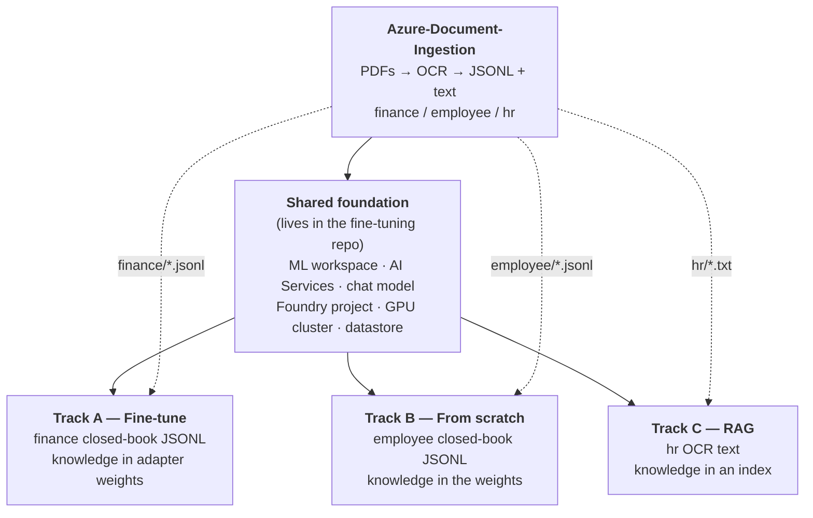

# Azure AI Reference Build — Start Here

Four repositories that build the same thing three different ways: a model that can answer
questions about a small set of business documents. The point of the set is the **comparison** —
the three methods fail differently, cost differently, and are secured differently.

Everything is synthetic and reproducible. You can run one track or all three.

| Repository | What it does | Required? |
|---|---|---|
| [Azure-Document-Ingestion](https://github.com/Auxin-io/Azure-Document-Ingestion) | Generates 30 PDFs, OCRs them with Document Intelligence, produces training data | **Yes — always first** |
| [Azure-FineTuning-Foundry-Agent](https://github.com/Auxin-io/Azure-FineTuning-Foundry-Agent) | Fine-tunes Qwen2.5-3B with QLoRA, serves it, wraps it in an agent | **Yes — it also builds the shared foundation** |
| [Azure-Employee-Pretraining](https://github.com/Auxin-io/Azure-Employee-Pretraining) | Trains a 3.2M-parameter model from scratch, random weights up | Optional track |
| [Azure-HR-RAG](https://github.com/Auxin-io/Azure-HR-RAG) | Retrieval over an index, no training at all | Optional track |

---

## How they depend on each other



Two things about this diagram are easy to miss and will cost you an afternoon if you do:

1. **Ingestion is not optional for any track.** It is the only thing that produces the data.
   No OCR output, nothing to train on or index.
2. **The fine-tuning repo is also the shared foundation.** Its Terraform creates the resource
   group, the ML workspace, the AI Services account, the chat-model deployment and the GPU
   cluster that the other two tracks assume already exist. Even if you only want RAG, you run
   its Step 1 and its Foundry-project step.

---

## Pick your path

| I want to… | Run | GPU quota needed? | Rough time |
|---|---|---|---|
| See the whole comparison | Ingestion → Foundation → A, B, C | Yes | a day, mostly waiting |
| Fine-tune a real model | Ingestion → Foundation → **A** | Yes | ~4 h (3 h is training) |
| Train a model from scratch | Ingestion → Foundation → **B** | Yes | ~1 h (77 s is training) |
| Do RAG only, cheapest path | Ingestion → Foundation → **C** | **No** — set `enable_gpu_cluster = false` | ~45 min |
| Just see the OCR pipeline | Ingestion only | No | ~20 min |

The RAG-only path is the one to start with if you are evaluating this. It needs no GPU quota,
trains nothing, and still produces a working agent with citations.

---

## Before you start

### Permissions

You need to be **Owner** on the subscription, or Owner plus User Access Administrator. Both
Terraform stacks create role assignments, and several steps grant roles to managed identities.
Contributor is not enough and fails late, after resources exist.

### GPU quota — check this first

This blocks more people than anything else. Tracks A and B need an Azure **Machine Learning**
quota for the `Standard NCASv3_T4 Family`, which is **separate from the Virtual Machines quota
of the same family**. A fresh subscription usually has 0.

Portal → **Quotas → Machine Learning → your region → Standard NCASv3_T4 Family**. If the limit
is 0, request **12 cores** before you start. Approval took under an hour for us, but it can take
longer, and you cannot proceed without it.

If the request is still pending, you can set `enable_gpu_cluster = false` in the fine-tuning
Terraform and run the RAG track in the meantime.

### Tools

| Tool | Version |
|---|---|
| Azure CLI | 2.89+, plus the ML extension: `az extension add -n ml` |
| Terraform | >= 1.9 |
| Python | 3.11+ |

### Region

Pick one region for everything. It needs three things available together: Document Intelligence,
GPU quota for the T4 family, and your chat model. `eastus`, `westus2` and `westeurope` are safe
choices. Mixing regions across the two Terraform stacks will work but adds egress and latency
for no benefit.

### If you are on Windows

Run everything from **Git Bash**, not PowerShell or CMD, and:

- Prefix any command containing an ARM resource ID with `MSYS_NO_PATHCONV=1`. Without it Git
  Bash rewrites `/subscriptions/...` into a Windows path and the command fails with a confusing
  error about the scope not being found.
- Put `PYTHONIOENCODING=utf-8` in front of the Python scripts, or the agent output crashes on
  the citation characters.

### Choose your own resource names

Both Terraform stacks derive **every** resource name from a single variable, `name_prefix`.
Set it once per stack and all names follow:

```bash
# terraform.tfvars, in each repo's terraform/ directory
name_prefix = "yourprefix"
location    = "eastus"
```

Globally-unique names get a random suffix appended automatically, so two people can run this in
the same subscription without colliding.

**One caveat you have to handle manually.** The three `create_agent.py` scripts hardcode the
resource group, the Foundry project name and the agent name near the top of the file — they do
not read `name_prefix`. If you change the prefix, edit these constants before running them:

| File | Line | Constants to change |
|---|---|---|
| `Azure-FineTuning-Foundry-Agent/agent/create_agent.py` | ~30 | `RG`, `ENDPOINT`, `PROJECT`, `AGENT_NAME` |
| `Azure-Employee-Pretraining/foundry/create_agent.py` | ~30 | `RG`, `ENDPOINT`, `PROJECT`, `AGENT_NAME` |
| `Azure-HR-RAG/rag/create_agent.py` | ~29 | `RG`, `PROJECT`, `AGENT_NAME`, `STORE_NAME` |

`Azure-HR-RAG/rag/fetch_documents.py` is the exception — it reads `AZURE_STORAGE_ACCOUNT` from
the environment, so export that instead of editing it.

Throughout this guide, `<angle-bracket>` values are things you choose or read back from
`terraform output`.

---

## Stage 0 — Ingestion

**Every path needs this.** Repo: `Azure-Document-Ingestion`.

It generates 30 PDFs across three datasets of ten documents each — finance (invoices, purchase
orders), employee (timesheets, expense reports), hr (policies, leave requests) — OCRs them, and
turns them into training data.

```bash
git clone https://github.com/Auxin-io/Azure-Document-Ingestion
cd Azure-Document-Ingestion

az login
cd terraform
terraform init
terraform apply          # with your own name_prefix in terraform.tfvars
terraform output
cd ..
```

That creates a resource group, a storage account with containers `raw` and `curated`, a
Document Intelligence account, and grants your identity `Storage Blob Data Contributor` and
`Cognitive Services User`.

Authentication is Entra ID end to end. Shared storage keys are **disabled** and Document
Intelligence local auth is **disabled**, so `az login` is the entire credential setup — the
scripts use `DefaultAzureCredential`. There are no keys to manage or leak.

Then export the connection values and run the pipeline:

```bash
export AZURE_STORAGE_ACCOUNT=$(terraform -chdir=terraform output -raw storage_account)
export AZURE_DOCINTEL_ENDPOINT=$(terraform -chdir=terraform output -raw docintel_endpoint)

pip install -r requirements.txt
bash run_all.sh
```

`run_all.sh` does four things in order: generates the PDFs, uploads them to `raw`, OCRs
everything with the `prebuilt-read` model into `curated`, and builds the JSONL datasets. The
OCR step is idempotent — re-running skips what is already done.

### Build the closed-book data for the track you want

`run_all.sh` builds the finance closed-book data by default. **Track B needs the employee set,
which is not built by default** — run it explicitly:

```bash
# Track A needs this (run_all.sh already did it):
python build_closed_book.py --dataset finance  --upload

# Track B needs this — run it yourself:
python build_closed_book.py --dataset employee --upload
```

`--upload` is what matters: it writes the JSONL into `curated/datasets/` in Blob Storage, which
is where Azure ML reads it from. Without `--upload` the files exist only on your laptop and the
training job cannot see them.

Track C needs no extra command — it uses the OCR text that `run_all.sh` already produced.

**Cost:** the Terraform defaults to the `S0` pay-as-you-go tier (~USD 1.50 per 1,000 pages).
Set `docintel_sku = "F0"` for the free tier instead — 500 pages a month, which covers these 30
documents many times over. Only one F0 Document Intelligence account is allowed per
subscription. Nothing in this stage bills by the hour.

### Check it worked

```bash
az storage blob list --account-name $AZURE_STORAGE_ACCOUNT --container-name curated \
  --auth-mode login --prefix documents/ -o table | head
```

You should see `documents/doc-finance-001.txt`, `doc-employee-001.txt`, `doc-hr-001.txt` and so
on — 30 text files plus their JSON metadata.

---

## Stage 1 — The shared foundation

**Every path needs this**, including RAG-only. Repo: `Azure-FineTuning-Foundry-Agent`.

This is the part the other repos' READMEs refer to as "Steps 1 and 5 of the fine-tuning repo".

```bash
git clone https://github.com/Auxin-io/Azure-FineTuning-Foundry-Agent
cd Azure-FineTuning-Foundry-Agent/terraform

terraform init
terraform apply          # your own name_prefix; enable_gpu_cluster = false if RAG-only
terraform output
```

That creates, in one resource group: an Azure ML workspace with its storage account, Key Vault,
App Insights and Log Analytics; a Container Registry; a GPU compute cluster at min 0 / max 1;
an AI Services account with a `gpt-4.1-mini` deployment; and your own data-plane role
assignments.

Note the outputs — you will paste them into later commands:

```bash
terraform output ml_workspace          # -> <workspace>
terraform output ai_services_account   # -> <ai-services>
terraform output container_registry    # -> <acr>
terraform output subscription_id       # -> <sub>
terraform output resource_group        # -> <ml-rg>
```

### Attach the registry to the workspace

Done outside Terraform on purpose — doing it in Terraform forces the workspace to be replaced
on later applies.

```bash
MSYS_NO_PATHCONV=1 az ml workspace update -n <workspace> -g <ml-rg> \
  --container-registry "/subscriptions/<sub>/resourceGroups/<ml-rg>/providers/Microsoft.ContainerRegistry/registries/<acr>" \
  --update-dependent-resources
```

### Confirm the workspace can actually see GPU quota

```bash
az ml compute list-usage -g <ml-rg> -w <workspace> -l <region> -o table
```

`Standard NCASv3_T4 Family` must be >= 4. If it reads 0 here, your quota request has not landed
yet, whatever the portal says.

### Create the Foundry project

Terraform cannot create this yet, so one REST call does. Pick your own project name:

```bash
AIS=/subscriptions/<sub>/resourceGroups/<ml-rg>/providers/Microsoft.CognitiveServices/accounts/<ai-services>

az rest --method put \
  --url "https://management.azure.com$AIS/projects/<project>?api-version=2025-04-01-preview" \
  --body '{"location":"<region>","identity":{"type":"SystemAssigned"},"properties":{}}'
```

The project gets a system-assigned managed identity. That identity — not you, and not a key —
is what calls the model endpoints later. Remember `<project>`; all three agent scripts need it.

### Link the ingestion data into the workspace

**Tracks A and B both need this, and it is easy to miss if you skip Track A.** The datastore
definition lives only in the fine-tuning repo, but the employee track's data assets point at
it too.

First let the workspace and the GPU cluster read the ingestion storage account. Shared keys are
disabled there, so this role grant is the only way in:

```bash
STG=$(az storage account show -n <ingest-storage> -g <ingest-rg> --query id -o tsv)
for ID in $(az ml compute show   -n <gpu-cluster> -g <ml-rg> -w <workspace> --query identity.principal_id -o tsv) \
          $(az ml workspace show -n <workspace>   -g <ml-rg>                --query identity.principal_id -o tsv); do
  MSYS_NO_PATHCONV=1 az role assignment create --assignee-object-id $ID \
    --assignee-principal-type ServicePrincipal --role "Storage Blob Data Reader" --scope $STG
done
```

Then register the container as a credential-less datastore. Nothing is copied — the workspace
reads the Blob container in place:

```bash
cd ../data
az ml datastore create -f datastore.yml -g <ml-rg> -w <workspace> --set account_name=<ingest-storage>
```

Skip this only if you are doing RAG-only — Track C reads Blob directly and never touches the
workspace.

---

## Stage 2 — Pick your tracks

Each track below is independent. Run one, two or all three.

### Track A — Fine-tune a 3B model (QLoRA)

Repo: `Azure-FineTuning-Foundry-Agent`, Steps 2–5.

Knowledge ends up in **adapter weights**. The model answers finance questions with no document
in the prompt.

```bash
# 1. Register the data assets (the datastore already exists from Stage 1)
cd data
az ml data create -f train.yml      -g <ml-rg> -w <workspace>
az ml data create -f validation.yml -g <ml-rg> -w <workspace>

# 2. Train — about 3 hours on one T4
cd ../training
az ml job create -f job.yml -g <ml-rg> -w <workspace> --query name -o tsv

# 3. Register the adapter and deploy the endpoint
#    (see the repo's Step 4 — it registers the model, builds the serving
#     environment and creates the managed online endpoint)

# 4. Let the Foundry project score the endpoint
PROJECT_ID=$(az rest --method get \
  --url "https://management.azure.com$AIS/projects/<project>?api-version=2025-04-01-preview" \
  --query identity.principalId -o tsv)
EP=$(az ml online-endpoint show -n <finance-endpoint> -g <ml-rg> -w <workspace> --query id -o tsv)
MSYS_NO_PATHCONV=1 az role assignment create --assignee-object-id $PROJECT_ID \
  --assignee-principal-type ServicePrincipal --role "AzureML Data Scientist" --scope $EP

# 5. Wait 5-10 minutes for the role to propagate, then create the agent
python -m venv .venv-agents
.venv-agents/Scripts/pip install -r agent/requirements.txt
PYTHONIOENCODING=utf-8 .venv-agents/Scripts/python agent/create_agent.py
```

The script finds the workspace and AI Services account in the resource group itself, puts the
live scoring URI into an OpenAPI spec, creates the agent on the chat model with the endpoint as
a tool, then asks three test questions and reports whether the tool was called. Two should call
it; "What is the capital of France?" should not.

> **This endpoint bills by the hour from the moment it deploys.** See *What it costs*.

### Track B — Train a model from scratch

Repo: `Azure-Employee-Pretraining`.

Needs: Stage 0 with `--dataset employee --upload`, and Stage 1 including the datastore.

Knowledge ends up in **the weights of a model you own entirely** — 3.2M parameters, random
initialisation, a word-level tokenizer built from the training rows. No pretrained weights are
downloaded anywhere.

```bash
# 1. Register the three data assets
cd data
az ml data create -f closed_book_train.yml      -g <ml-rg> -w <workspace>
az ml data create -f closed_book_validation.yml -g <ml-rg> -w <workspace>
az ml data create -f closed_book_test.yml       -g <ml-rg> -w <workspace>

# 2. Train — 77 seconds of compute, but expect ~10 minutes the first time
#    while the container image builds
cd ../training
az ml job create -f job.yml -g <ml-rg> -w <workspace> --query name -o tsv

# 3. Register and deploy (repo Step 3), then create the agent (repo Step 4)
python -m venv .venv-agents
.venv-agents/Scripts/pip install -r foundry/requirements.txt
MSYS_NO_PATHCONV=1 PYTHONIOENCODING=utf-8 .venv-agents/Scripts/python foundry/create_agent.py
```

This endpoint runs on one CPU core, so it is far cheaper than Track A's — but it still bills
continuously while deployed.

**What to look for.** The job log ends with `validation exact match=1.000` and
`test (unseen phrasing) exact match≈0.74`. That gap is the lesson: it memorised its ten
documents and generalises poorly, and it will answer confidently about things it never saw.
Try asking it about a person who does not exist.

### Track C — RAG, no training

Repo: `Azure-HR-RAG`. The cheapest and fastest track. No GPU, no endpoint, no training.

Knowledge stays **in an index, read at question time**. Answers carry a filename citation, and
questions outside the documents are refused.

Needs: Stage 0, and from Stage 1 only the AI Services account, the chat model, the Foundry
project and your Foundry data-plane role. No workspace, no datastore, no GPU.

```bash
git clone https://github.com/Auxin-io/Azure-HR-RAG
cd Azure-HR-RAG

python -m venv .venv
.venv/Scripts/pip install -r rag/requirements.txt

# 1. Pull the OCR text down from the ingestion storage account
export AZURE_STORAGE_ACCOUNT=<ingest-storage>
MSYS_NO_PATHCONV=1 PYTHONIOENCODING=utf-8 .venv/Scripts/python rag/fetch_documents.py

# 2. Upload, index and create the agent
MSYS_NO_PATHCONV=1 PYTHONIOENCODING=utf-8 .venv/Scripts/python rag/create_agent.py
```

Step 2 uploads the ten files, builds a Foundry-managed vector store — Foundry does the
chunking, embedding and indexing — and creates the agent with the `file_search` tool bound to
that store. Then it asks three questions and reports whether retrieval happened.

Expect the third to be refused: *"I can only answer questions related to the company's HR
documents."* That refusal is the point. Compare it with Track B inventing an answer.

Re-run with `--reindex` after changing a document, or `--ask "..."` for your own question.

---

## What it costs

Almost all of it is free at idle. **The exception is the managed online endpoints in Tracks A
and B, and they are not a small exception.**

| Thing | When it bills |
|---|---|
| **GPU online endpoint (Track A)** | **continuously, from deploy to delete** |
| CPU online endpoint (Track B) | continuously, from deploy to delete |
| GPU/CPU training clusters | only while a job runs — they scale to zero |
| Document Intelligence | per page (free on F0) |
| Chat model deployment | per token |
| Vector store (Track C) | storage only; these files are ~10 KB |
| Storage, Key Vault, registry, Log Analytics | pennies to a few dollars a month |

Measured on our own build: the resource group sat at about **USD 0.25/day** with no endpoints
deployed, and about **USD 18/day** with the T4 endpoint running — roughly **USD 540/month** for
one GPU endpoint nobody was querying. A single forgotten endpoint is the entire cost of this
project.

If you are pausing between sessions, delete the endpoints and redeploy later. The registered
model stays in the workspace, so redeploying is minutes and does not mean retraining.

## Tear it down

Order matters: endpoints first, so you stop the meter immediately.

```bash
# 1. The expensive part — delete these the moment you are done
az ml online-endpoint delete -n <finance-endpoint>  -g <ml-rg> -w <workspace> --yes
az ml online-endpoint delete -n <employee-endpoint> -g <ml-rg> -w <workspace> --yes

# 2. Agents and vector store (see each repo's teardown snippet)

# 3. Everything else
terraform destroy      # in the fine-tuning repo
terraform destroy      # in the ingestion repo
```

Deleting an endpoint takes about five minutes and takes its deployment with it.

Two things `terraform destroy` will not remove, because Terraform never created them: the
**Foundry project** (delete it with `az rest --method delete` on the same URL you created it
with) and any **Azure Bot Service** that the optional Copilot publishing step created.

---

## Troubleshooting

| Symptom | Cause |
|---|---|
| Quota error creating the GPU cluster | Machine Learning quota for `NCASv3_T4`, not VM quota. Check with `az ml compute list-usage`, not the VM quota page. |
| `scope was not found`, or a mangled `C:/Program Files/...` path in the error | Git Bash rewrote an ARM resource ID. Prefix the command with `MSYS_NO_PATHCONV=1`. |
| Training job fails reading the data | The compute cluster's identity is missing `Storage Blob Data Reader` on the ingestion storage account, or you skipped `--upload` in Stage 0. |
| Agent replies but never calls its tool | The Foundry project's managed identity has no `AzureML Data Scientist` on the endpoint, or the grant has not propagated — wait 5–10 minutes. |
| `create_agent.py` cannot find the project | It hardcodes `RG` and `PROJECT`. Edit the constants at the top of the file to match your names. |
| Document Intelligence creation fails | Either the region does not offer it, or you already have an F0 account — only one per subscription. |
| Agent output crashes on Windows | Set `PYTHONIOENCODING=utf-8`. |
| First training job sits in `Preparing` for ~10 minutes | Normal — the container image is building in the registry. Later runs reuse it. |

---

## Which method should you actually use?

| | Fine-tune (A) | From scratch (B) | RAG (C) |
|---|---|---|---|
| Training time | ~3 h on a T4 | 77 s on a T4 | none |
| Updating knowledge | retrain the adapter | retrain the model | re-upload the file |
| Cites its source | no | no | **yes** |
| Handles a changing corpus | poorly | poorly | **well** |
| Answers about a document it never trained on | no | no | yes, once indexed |
| Cost at idle | endpoint per hour | endpoint per hour | storage only |
| Fails by | sounding confident | sounding confident | refusing |

RAG is the right default when the corpus changes or answers must be auditable. Training earns
its cost when the knowledge must be available with no retrieval step, or served by a model you
own outright.

The security consequence is the part worth keeping: **a fine-tuned or from-scratch model cannot
cite, refuse, or be un-taught.** Once a fact is in the weights, removing it means retraining.
RAG keeps knowledge in a place you can audit, permission and delete.
